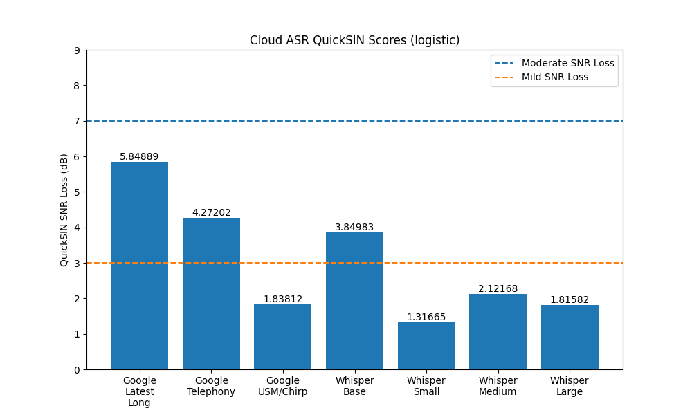
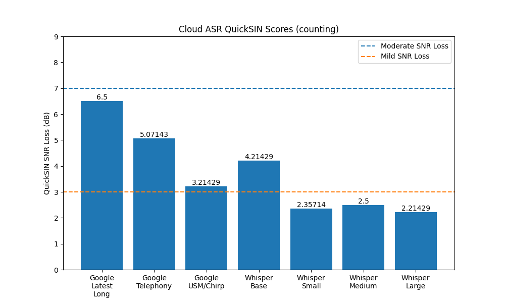

# Measuring automatic speech-in-noise recognition with QuickSIN
Malcolm Slaney and Matt Fitzgerald,
Stanford University

## Abstract
We propose a standardized test 
to characterize how modern speech recognition system perform in noise. 
The QuickSIN test described here measures the ability of humans 
to recognize speech in noise.
In real life these abilities are impacted by
a number of factors including peripheral sensitivities, neural issues such 
as synaptopathy, and any number of cognitive issues. The QuickSIN test scores
human subjects from normal, to mildly, moderately, 
and then severely impaired based upon 
the signal-to-noise ratio (SNR) where the subject correctly recognizes 50% 
of the keywords. 
By grounding automatic speech-in-noise performance to human abilities
we have a more realistic metric for automatic speech recognizers (ASR).
We demonstrate that a modern recognizer, built using millions of hours of 
unsupervised training data, is mildly impaired in noise compared 
to human subjects.

Note: Version 2.0 of this release corresponds to the paper we published.  
You should be able to regenerate the results in the paper with this version
[Link to V2.0](https://github.com/MalcolmSlaney/QuickSIN_Benchmark/releases/tag/v2.0)

## Introduction

For many years, speech recognizers have performed better than human in 
*clean* speech 
[[Xiong 2017](https://ieeexplore.ieee.org/abstract/document/8461870)].
But noisy speech is a problem, since recognizers
do not have any concept of auditory stream analysis
[[Bregman 1990](https://direct.mit.edu/books/book/3887/Auditory-Scene-AnalysisThe-Perceptual-Organization)],
tracking a single speaker,
or other cues that humans use to recognize a speaker's speech
in noisy environments.

In this letter we propose using 
[QuickSIN](https://pubmed.ncbi.nlm.nih.gov/15532670/)
to measure the performance of automatic speech recognition (ASR) systems. 
QuickSIN is used by audiologist to measures a human subject's 
ability to recognize speech with a noisy background.  It measures the 
signal-to-noise ratio (SNR) where subject correctly recognize
50% of the key words.
A single test uses a list of 6 different sentences at 6 different SNR levels
(25, 20, 15, 10, 5, 0dB) and asks the subject to repeat the words that they 
heard. It is scored by counting the number of correctly recognized
keywords in each sentence.

It is difficult to characterize realistic background noise. White noise is
stationary and ergodic, but unrealistic. 
Speech power constantly varies and when the speech is in the background, and
thus in the denominator of the SNR calculation, 
the result is more uncertain. 
Speech enhancement efforts struggle to find the right metric to describe their
improvements [[Leroux 2018](https://arxiv.org/abs/1811.02508#)].
In this paper we suggest that  QuickSIN is a good
metric since it is connected to human performance.

In this letter we introduce QuickSIN, demonstrate its use, and characterize
the performance of a modern speech recognition system.

## Methods
In a QuickSIN test a user listens to the sentences at
a comfortable listening level (70dB SPL).
After each sentence the subject is asked to repeat the words they
heard and the result is scored based on the number of keywords (up to five) 
correctly recognized. An audiologist scores the test by subtracting the total number 
of correctly recognized keywords from 25.5.  This gives the loss, in dB, of
the subject compared to a normal listener, as explained below.
Multiple sentence lists (each with 6 sentences and
5 keywords) are averaged to reduce the test variance.

A QuickSIN audio file is 60 seconds long,
consisting of the 6 sentences at different
SNRs. 
For our automated tests
the entire file is passed to the recognizer, which returns all the words
that are recogized, and their start and stop times. 
Automated scoring is more difficult in this test because computers are precise, 
and "four" and "for" are equally good answers for
the QuickSIN test.  We thus use a table of homonyms and other normalizations
to match audiologist behavior. We take a strict scoring protocol, where 
all "phonemes" must be recognized correctly, as any errors indicate that the
speech was heard incorrectly.
Thus "4" and "four" are the same word, and "Tara" is taken to be
equal to "Tear a", 
while "sheet" and "sheep" or "chart" and "charts" are scored as misses.

The ground truth for QuickSIN list 3, sentence 4, looks like this (where the 
5 keywords to count are underlined):
[[Sklaney2006](https://etda.libraries.psu.edu/files/final_submissions/5788)]:

&nbsp;&nbsp;&nbsp;&nbsp;&nbsp;&nbsp;The <ins>stems</ins> of the <ins>tall</ins> <ins>glasses</ins> <ins>cracked</ins> and <ins>broke</ins>.

We match the recognized words with the expected keywords and count the number
of matches.
This score (the number of correctly identified words over all 6 sentences)
is converted into an SNR-50 (the SNR which gives 50% accuracy)
using the following approximation [Etymotic2001, 
[ASHA Policy](https://www.asha.org/policy/gl1988-00008/)]:
```
The QuickSIN has five words per step and 5 dB per step. Our highest SNR is
25 dB so we take 25 + 2.5 = 27.5 minus the total number of words repeated 
correctly. This gives what we call SNR-50, the signal-to-noise ratio required
for the patient to repeat 50% of the words correctly.
```
Furthermore this is converted into SNR Loss (compared to normal human listeners)
```
Since SNR-50 for normal-hearing persons is 2 dB, we subtract 2 dB to 
derive the formula for a patient's SNR LOSS: 25.5 – (Total words correct 
in 6 sentences)
```

The counting method described above is an approximation, and it is used because
it allows audiologists to easily score the test in real time.
We can also fit the data to a logistic curve by
converting the number of correctly recognized keywords at each SNR
into a fraction, and then fit
a logistic regression curve to it [Nunez-Iglesias].
This gives us a curve from which we can
estimate the SNR which produces 50% accuracy, as illustrated in Figure 1.


Figure 1: Raw QuickSIN recognition scores for 6 sentences at 6 different SNRs,
and the best logistic fit to these scores.

## Results

We characterize the QuickSIN measure using a state of the art recognizer from 
Google.
The [USM system](https://arxiv.org/abs/2303.01037)
is an example of a large-scale unsupervised model for speech
and uses over 2 billion parameters to
efficiently represent speech signals.
This system is available commercially in the cloud as a system called
[Chirp](https://cloud.google.com/speech-to-text/v2/docs/chirp-model)
and is the focus of this test.
Most importantly, our goal is *not* to define the state of the art.
Other commercial entities have similar 
technology [Radford2023] and we want to demonstrate
current abilities, and make the QuickSIN tools available to others.

We use the unmodified QuickSIN sentences and send them to the Cloud ASR system,
ask it to recognize the speech using 6 different models, 
optimized for different kinds of speech, and then score the results.

We tested the performance of six different recognizers, and plot their speech
recogition results over the 6 different SNRs in Figure 2.


Figure 2: Fraction of keywords recognized correctly
as a function of SNR for all 12 lists and all
6 ASR models tested here.

We score the recognizer's performance using both the original counting method
and logisitc regression, as they produce different scores for the 
speech reception threshold. This is shown in Figure 3.




Figure 3: QuickSIN loss (relative to a normal human listener) for all six
recognizers tested here, compared to clinical diagnosis levels.

The SNR-50 score differs depending on whether it is calculated by the
conventional counting approach or via logistic regression.
This difference appears to be systematic and is shown in the scatter plot below.
Using linear regression we measure a 1.5dB downward shift (optimism)
in the results when using the regression approach.
While the regression method has a firmer statistical basis, we compare 
to human results
using the counting method since that is what conventionally defines the 
normal, mild, moderate, and severely impaired limits.


Figure 4: The results of logistic regression vs.
the QuickSIN counting approximation
showing a systematic 1.5dB pessimism by the counting approximation.
Note: the "latest short" result is not included in this scatter plot because 
it represents an outlier from the better performing models.

Our goal is to provide a reliable way to characterize speech-in-noise
recognition.
Thus we suggest using the logistic regresion method to find the
SNR-50 (via regression), subtract 2dB to account for expected human performance
and then add 1.5dB to account for the difference between the regression and 
counting approaches.  By this method we arrive at a QuickSIN loss that 
we can match to human expectations.
The defined impairments are normal (<3dB), 
mildly impaired (>3dB and < 7dB) and severly impaired (> 7dB).

## Discussion

We believe that QuickSIN is a simple and effective way to characterize
the perforamnce of ASR system when recognizing noisy speech. 
While there are many types of noise and ways to measure it, 
we believe is is important to ground the results to human performance.
Thus in our example the performance of a state of the art recognizer
rates as mildly impaired when scored on this human test.

This approach has four caveats.
Most importantly, the speech recognition
system has no sense of speaker identity or other aspects of auditory scene
analysis [Bregman1990].
Second, a human listener might attend more closely to the foreground
speach, and thus more easily ignore the background noise. 
Thirdly, the 
speech recognition system is assuming a much wider vocabulary
than one might expect in an audiology booth.
(In some cases we had to look up the recognized token
to see that it really was a word.)
Finally, we took an especially firm stance
on similar words, which is good for reproducibility, but might not be how
human audiologists score it in a real-time test.

At this point, even an ASR engine trained with 12M hours of speech is
mildly impaired compared to normal human performance in noise. 
We hope the
QuickSIN test we propose here will allow speech recognition engineers to
iterate towards a better solution.


---

## Implementation Notes

This code implements the QuickSIN test, and uses it to test a modern
(cloud-based) speech recognition system.  To run this code, you need
the QuickSIN audio files, either from 
[Etymotic](https://www.etymotic.com/product/quicksin/)
or your favorite audiologist, as well as a Google Cloud project id you can
charge the 
[API calls](https://cloud.google.com/speech-to-text/v2/docs/sync-recognize)
against. This code runs on your local machines, reads the QuickSIN
audio files, sends the audio to the cloud for recognition, and then scores
the results.

The main program (google_asr_sin.py) caches the intermediate results 
to make it easier to replot the results.
The table below shows the purpose of each cache file,
the command line flag that specifies the file,
and the default file name are shown in the table below.

|                   | **Command Line Flag**   | **Default File Name**  |
|-------------------|-------------------------|------------------------|
| Ground Truth      | ground_truth_cache      | ground_truth.json      |
| Model Recognition | model_recognition_cache | model_recognition.json |
| Model Result      | model_result_cache      | model_result.json      |

