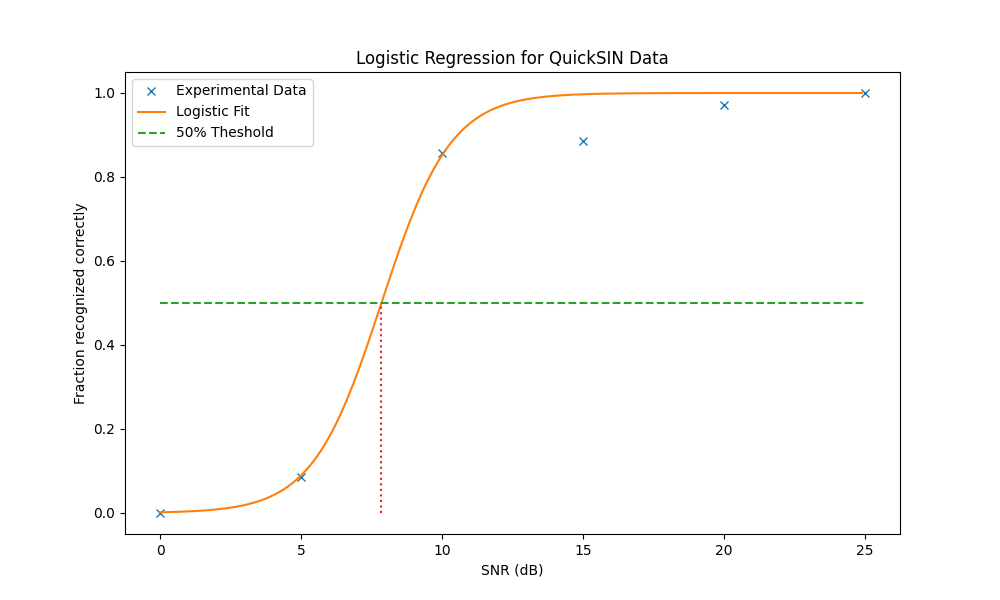
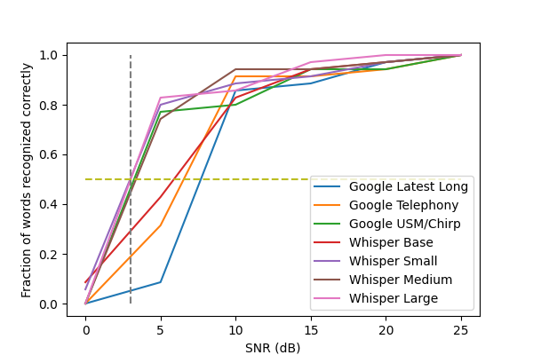

## Introduction

This code implements the QuickSIN test, and uses it to test a modern
(cloud-based) speech recognition system.  To run this code, you need
the QuickSIN audio files, either from 
[Etymotic](https://www.etymotic.com/product/quicksin/)
or your favorite audiologist, as well as a Google Cloud project id you can
charge the 
[API calls](https://cloud.google.com/speech-to-text/v2/docs/sync-recognize)
against. This code runs on your local machines, reads the QuickSIN
audio files, and sends them to the cloud for recognition.

For many years, speech recognizers have performed better than human in 
*clean* speech 
[[Xiong 2017](https://ieeexplore.ieee.org/abstract/document/8461870)].
But noisy speech has been more of a problem, since recognizers
do not have any concept of auditory stream analysis, tracking a single speaker,
or other cues that humans use to recognize a speaker's speech
in noisy environments.

[QuickSIN](https://pubmed.ncbi.nlm.nih.gov/15532670/) measures a subject's 
ability to recognize speech with a noisy background.  It measures the 
signal-to-noise ratio (SNR) where subject get 50% of the key words correct.
A single test uses 6 different at 6 different SNR levels
(25, 20, 15, 10, 5, 0dB) and asks the subject to repeat the words that they 
heard. It is scored by counting the number of correct keywords (up to 5)
in each sentence.

Recently speech recognition systems have been trained on *millions* of hours
of speech in an unsupervised fashion.  Unsupervisered means that the deep
neural network (DNN) learns about speech without knowing what it means.  The
initial stages of the training are trying to predict masked or hidden parts of
the speech "spectrogram."  By this approach the system has a very good model
of what speech looks like because given a little bit of speech
it can predict the missing portions.
Most importantly, the representation that the system learns is a very efficient
representation of speech, each frame containing a lot of information about 
what has come before and what is to come next. 
Thus given this representation it is easily able to connect this speech 
data to word labels, and thus learn how to recognize speech, or perform
text to speech. 

One recent example of the new unsupervised models for speech is the 
[USM system](https://arxiv.org/abs/2303.01037), which uses over 2B parameters
to capture the speech signal. 
This system is now available commercially as a system called
[Chirp](https://cloud.google.com/speech-to-text/v2/docs/chirp-model)
and is the focus of this test.  Other commercial entities have similar 
technology and our goal is not to perform a bakeoff, but to demonstrate
current abilities, and make the QUickSIN tools available to others.

## Implementation

We use the unmodified QuickSIN sentences and send them to the Cloud ASR system,
ask it to evaluate the speech using one of a number of different models, 
optimized for different kinds of speech, and then score the results.
Scoring is more difficult in this test because computers are so precise, and
they don't at first know that "four" and "for" are equally good answers for
the QuickSIN test.  We thus use a table of homonyms and other normalizations
to match audiologist behavior. We take a strict scoring protocol, where 
all "phonemes" must be recognized correctly, as any errors indicate that the
speech was heard incorrectly.

A QuickSIN audio file is 60 seconds long, consisting of 6 sentences at different
SNRs.  The entire file is passed to the recognizer, which returns all the words
that are recogized, and their start and stop times.  These recognized words 
and their times are compared to the expected keywords, taking into account 
homonyms, and within a small window (2s).  The ground truth looks like this

```
L 3 S 4  stems Tall Glasses cracked broke
```

## Results
The QuickSIN test gives us the number of keywords (up to 5) correctly 
recognized by the subject.  We convert this into a fraction, and then fit
a logistic regression curve to it (as opposed to the counting method 
first proposed).  This gives us a curve from which we can
estimate the SNR which produces 50% accuracy, as shown in the example below.



We tested the performance of six different recognizers, and plot their speech
recogition results over the 6 different SNRs.



We score the recognizer's performance using both the original counting method
and logisitc regression, as they produce different scores for the 
speech reception threshold.


